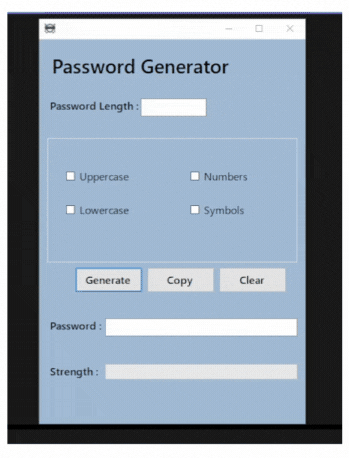
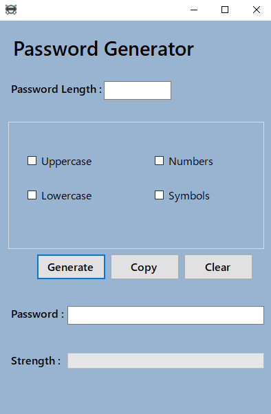
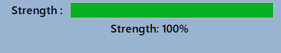

# 🔑 Password Generator - Windows Forms App

A **C# Windows Forms Password Generator** designed to create secure and customizable passwords quickly.  
Built as a learning project to practice UI design, event-driven programming, and password generation logic.

---

## 💡 About this Project

✨ Developed by a college student exploring C# and Windows Forms.....(Again lol)  
📚 Purpose: Learn password security logic, checkbox controls and UI updates.  
🎯 Features: Customizable passwords, strength meter, copy-to-clipboard notification.  
🎲 Fun fact: Generates at least one of each selected character type for stronger passwords!

---

## ⚡ Features

- Include uppercase letters, lowercase letters, numbers and symbols  
- Adjustable password length  
- Ensures at least one of each selected character type is included  
- Generates random secure passwords  
- Password strength meter (0–100%)  
- Copy password to clipboard with subtle notification  
- Clear all selections and output with one click  

---

## 🖥️ Form Layout

| Component       | Description                           |
|-----------------|---------------------------------------|
| `lengthTXT`     | Input password length                  |
| `upperCHK`      | Include uppercase letters             |
| `lowerCHK`      | Include lowercase letters             |
| `numberCHK`     | Include numbers                       |
| `symbolCHK`     | Include symbols                       |
| `generateBTN`   | Generate password                     |
| `copyBTN`       | Copy password to clipboard            |
| `clearBTN`      | Reset all fields                       |
| `outputTXT`     | Displays generated password           |
| `strengthBar`   | Shows password strength (0–100%)     |
| `notifyLBL`     | Shows "Copied!" notification          |

---

## 📷 Screenshots & Showcase

  
  

---

## 🚀 Usage

1. Enter desired password length in **Length** field.  
2. Check character types to include (uppercase, lowercase, numbers, symbols).  
3. Click **Generate** to create a password.  
4. Click **Copy** to copy it to clipboard (notification appears).  
5. Click **Clear** to reset all inputs.

---

## 📥 Download & Run

Click the button below to download the latest release:

  

**Instructions:**  
1. Extract the downloaded `.zip` or `.rar` file.  
2. Run `PasswordGenerator.exe`.  
3. Generate and copy secure passwords instantly!

---

## 🛠️ Tech Stack

- **Language:** C#  
- **Framework:** .NET (Windows Forms)  
- **IDE:** Visual Studio 2022  
- **OS:** Windows

---

## 💬 Notes

- Beginner-friendly project for learning C# Windows Forms development.  
- Screenshots and `.exe` provided for reference.  
- Code may contain practice implementations for educational purposes.
